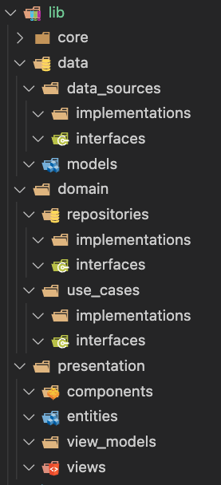

# Clean Architecture CRM (Customer relationship management)

In this project, we will explore the process of creating a CRM application using a Clean Architecture way.

Clean architecture is a software design philosophy that organizes code in such a way that it encapsulates the business logic but keeps it separate from the implementation.

The aim is to allow the core parts of the application to deal with changing implementations of other parts of the application.

We should be able to change presentation layer parts (UI for web and mobile, Routes for APIs) easily without changing the domain layer parts (use cases and repository or adapter) and data layers (MS SQL, PostgreSQL, MongoDB, etc infrastructure data sources)

Clean Architecture was originally illustrated by Uncle Bob using the following image


Here we see that each onion layer only knows and cares about its immediate inner layer as illustrated by arrows drawn from outer to inner.

A more contextual front-end application illustration would be the following image which illustrates a flow of control and dependencies between different components of the application.


Let's start with first creating a few non-testable parts of the application like folders, entities, and interfaces(abstract classes in Flutter).

First, we create containers for all code:




The first thing we'll do is clean up the pubspec.yaml file

```yaml
name: crm
description: Nanosoft's Mobile CRM
publish_to: "none"
version: 1.0.0+1
environment:
  sdk: ">=2.18.2 <3.0.0"
dependencies:
  flutter:
    sdk: flutter
  cupertino_icons: ^1.0.2
dev_dependencies:
  flutter_test:
    sdk: flutter
  flutter_lints: ^2.0.0
flutter:
  uses-material-design: true
```

