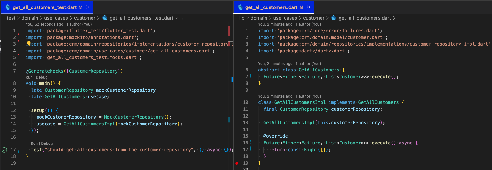
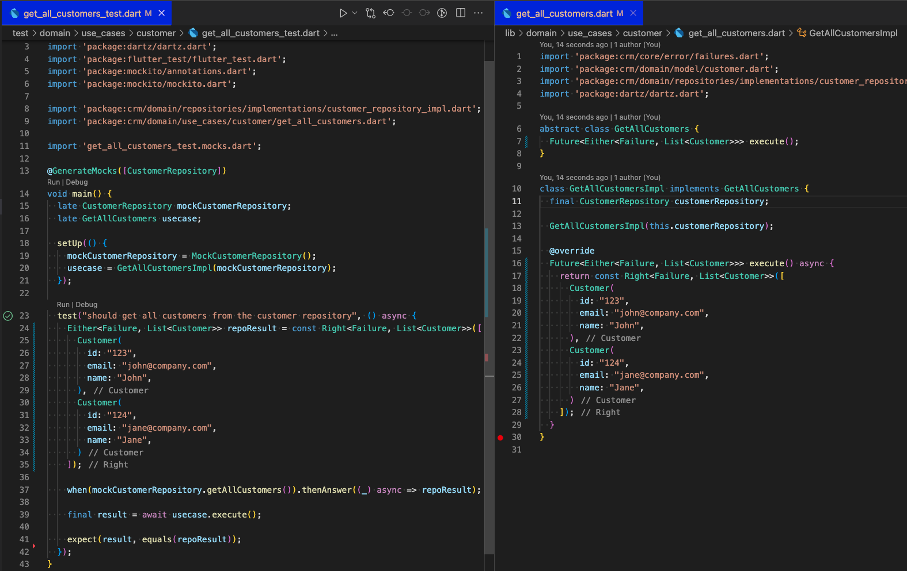
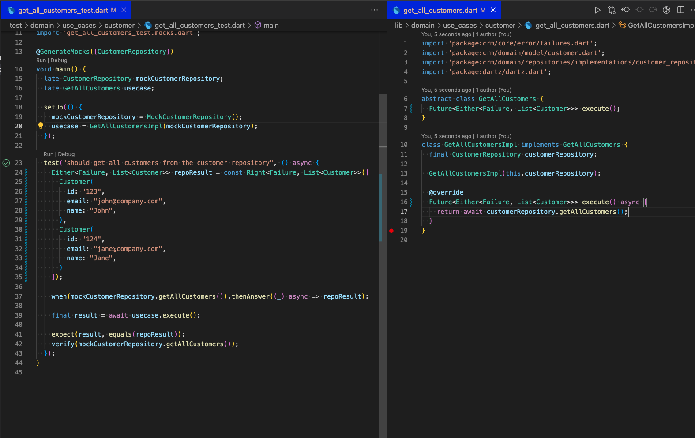

# Clean Architecture CRM (Customer relationship management)

In this project, we will explore the process of creating a CRM application using a [Robert C Martin](https://en.wikipedia.org/wiki/Robert_C._Martin) philosophy called Clean Architecture.

We'll be using Flutter/Dart for this application and discuss TDD and Error Handling

### Use Cases of the Application
Customer Relationship Management (CRM) is a strategy that companies use to manage interactions (or tasks) with customers and potential customers (leads).

We'll implement the following use cases:
##### Customers
* Get all customers
* Create customer
* Update customer information
* Make customer inactive
* Make customer active
* Delete customer
 
##### Leads (Potential Customers )
* Get all leads
* Create new lead
* Convert lead to customer
* Update lead details

##### Tasks
* Get all activities for customer
* Create customer task
   

### What is Clean Architecture?
"Clean Architecture" was coined by [Robert C Martin](https://en.wikipedia.org/wiki/Robert_C._Martin) and is a software design philosophy that organizes code in such a way that business logic is kept separate from technical implementation (databases, APIs, frameworks). This makes it easy to maintain, change and test.

We should be able to change the presentation (UI) or data source (databases or API) easily without changing the business logic (use cases).


<div style="text-align:center">
  
  <p style="color:gray; font-size:13px">Uncle Bob's Clean Architecture</p>
</div>


In the diagram, we see that each onion layer only knows and cares about its immediate inner layer as illustrated by arrows drawn from outer to inner.

A more contextual front-end application illustration of clean architecture would be the following image which illustrates flow of control and data.

<div style="text-align:center">
  
  <p style="color:gray; font-size:13px">Control and Data flow</p>
</div>

Before we start let's install a few flutter dependencies by adding the following packages to our *pubspec.yaml* file: 
* **Equatable** for object comparison
* **Dio** for HTTP calls
* **Mockito** for mocking dependencies in our tests
* **dartz** to help with functional programming in Dart
* **uuid** to genereate unique ids

```yaml
//pubspec.yaml
name: crm
description: Mobile CRM
publish_to: "none"
version: 1.0.0+1
environment:
  sdk: ">=2.18.2 <3.0.0"
dependencies:
  flutter:
    sdk: flutter
  cupertino_icons: ^1.0.2
  equatable: ^2.0.5
  dio: ^4.0.6
  uuid: ^3.0.6
  dartz: ^0.10.1
dev_dependencies:
  flutter_test:
    sdk: flutter
  flutter_lints: ^2.0.0
  mockito: ^5.3.2
  build_runner: ^2.3.0
flutter:
  uses-material-design: true
```

### Models
In any application, the first place to start would be the models of the application. Models typically represent real-world objects that are related to the problem or domain space. 

##### Customer Model
```dart
//lib/domain/models/customer.dart
import 'package:equatable/equatable.dart';

enum CustomerType {
  lead,
  customer,
}

class Customer extends Equatable {
  final String id;
  final String name;
  final String email;
  final CustomerType customerType;
  final bool isActive;

  const Customer({
    required this.id,
    required this.name,
    required this.email,
    this.isActive = true,
    this.customerType = CustomerType.customer,
  });

  @override
  List<Object> get props {
    return [id, name, email, isActive, customerType];
  }
}

```

##### Task Model

 ```dart
 //lib/domain/models/task.dart
 import 'package:crm/domain/models/customer.dart';

enum Status { notStarted, inProgress, completed }

enum Priority { low, normal, high }

class Task {
  final String id;
  final Customer customer;
  final Priority priority;
  final String subject;
  final Status status;
  final DateTime dueDate;

  const Task({
    required this.id,
    required this.customer,
    this.priority = Priority.high,
    this.status = Status.notStarted,
    required this.subject,
    required this.dueDate,
  });
}

 ```

### Error and Exception Handling
Typically exceptions and errors are caught and handled by using "try-catch" blocks wrapping a piece of code that might throw. Functions like these are said to have side effects.

<div style="text-align:center">
  
</div>

Languages like Java, allow you used to use the keyword "throws" to mark a function that might have exception side effects. The Dart language does not allow you to mark functions as potentially throwing, we typically allow the error to bubble up to a point where it can be centrally handled (typically near the UI). There is nothing wrong with this. We would like to however take a different approach. Instead of throwing exceptions, we'd like to catch side-effect exceptions and channel the failure to the function's return value.

<div style="text-align:center">
  
</div>

This is a Functional Programming (FP) approach or creating pure functions (functions without side effects). The [**dartz**](https://pub.dev/packages/dartz) package gives us the ability to write Dart in a more FP way. It has a type called **Either**  which is used to represent a value that can have two possible types, (Left and Right). We'll use this type as our deterministic return type of the function

Let's define the Failure type
```dart
//lib/core/error/failures.dart
import 'package:equatable/equatable.dart';

abstract class Failure extends Equatable {
  const Failure([List props = const <dynamic>[]]);
}
```

Let's see this in action when we write an interface/contract for our customer repository. We always need an interface for any injectable class. This class will be used and hence injected into several use case classes later.

```dart
//lib/domain/repository/interfaces/customer_repository.dart
import 'package:crm/core/error/failures.dart';
import 'package:crm/domain/model/customer.dart';

import "package:dartz/dartz.dart";

abstract class CustomerRepository {
  Future<Either<Failure, List<Customer>>> getAllCustomers();
  Future<Either<Failure, void>> createCustomer(Customer data);
  Future<Either<Failure, void>> deleteCustomer(String id);
  Future<Either<Failure, void>> updateCustomer(String id, Customer data);
}

```

#### TDD

##### Use Case: Get All Customers
Before we create the "Get all customers" use case let's define an interface or contract for it. From the flow diagram above, we can see that this class will be used by one or more view models.

```dart
//lib/domain/use_cases/customer/get_all_customers.dart
import 'package:crm/core/error/failures.dart';
import 'package:crm/domain/model/customer.dart';
import 'package:dartz/dartz.dart';

abstract class GetAllCustomers {
  Future<Either<Failure, List<Customer>>> execute();
}
```


We now need to create the implementation of this interface. We'll use the same file to hold the implementation of this interface. 

The whole process of TDD can be broken down into these steps:

* Write test code, but it doesn’t compile (of course).
* Write production code to make test compile.
* Write test code that compiles but fails an assertion.
* Write production code to make test pass.

Let's write the first test.
```dart
//test/domain/use_cases/customer/get_all_customers_test.dart
import 'package:flutter_test/flutter_test.dart';
import 'package:mockito/annotations.dart';

import 'package:crm/domain/repositories/implementations/customer_repository_impl.dart';
import 'package:crm/domain/use_cases/customer/get_all_customers.dart';

import 'get_all_customers_test.mocks.dart';

@GenerateMocks([CustomerRepository])
void main() {
  late CustomerRepository mockCustomerRepository;
  late GetAllCustomers usecase;

  setUp(() {
    mockCustomerRepository = MockCustomerRepository();
    usecase = GetAllCustomersImpl(mockCustomerRepository);
  });

  test("should get all customers from the customer repository", () async {
   
  });
}
```


###### Test Result: 
```
Failed to load "get_all_customers_test.dart": Compilation failed
```
##### *A note on Mocks*
Because the "get all customers" use case has a customer repository dependency, we need to mock the customer repository based on the customer repository interface.
We add the generate attribute to our test to instruct Dart to generate mocks and place it next to the test file.

```dart
@GenerateMocks([CustomerRepository])
```

To use Mockito's generated mock classes, add a build_runner dependency in your package's pubspec.yaml file, under dev_dependencies; something like build_runner: ^1.11.0. We then generate the mocks by running the following command in the project folder

```
$> flutter pub run build_runner build
```
Once the mock is generated you can import it 

```dart
import 'get_all_customers_test.mocks.dart';
```

The setup of the test is now complete but the test fails because the class "GetAllCustomersImpl" does not exist. 

Let's write some production code to make the test pass
```dart
//lib/domain/use-cases/customer/get_all_customers.dart
import 'package:crm/core/error/failures.dart';
import 'package:crm/domain/model/customer.dart';
import 'package:crm/domain/repositories/implementations/customer_repository_impl.dart';
import 'package:dartz/dartz.dart';

abstract class GetAllCustomers {
  Future<Either<Failure, List<Customer>>> execute();
}

class GetAllCustomersImpl implements GetAllCustomers {
  final CustomerRepository customerRepository;

  GetAllCustomersImpl(this.customerRepository);

  @override
  Future<Either<Failure, List<Customer>>> execute() async {
    return const Right([]);
  }
}
```
The test now passes

<div style="text-align:center">
  
</div>

Let's write a test that compiles but fails assertion,

```dart
  test("should get all customers from the customer repository", () async {
    Either<Failure, List<Customer>> repoResult = const Right<Failure, List<Customer>>([
      Customer(
        id: "123",
        email: "john@company.com",
        name: "John",
      ),
      Customer(
        id: "124",
        email: "jane@company.com",
        name: "Jane",
      )
    ]);

    when(mockCustomerRepository.getAllCustomers()).thenAnswer((_) async => repoResult);

    final result = await usecase.execute();

    expect(result, equals(repoResult));
  });
```

###### Test Result: 
```
  Expected: Right<Failure, List<Customer>>:<Right([Customer(123, John, john@company.com, true, CustomerType.customer), Customer(124, Jane, jane@company.com, true, CustomerType.customer)])>
    Actual: Right<Failure, List<Customer>>:<Right([])>
```

We can make it pass by simply hard coding a result

<div style="text-align:center">
  
</div>

This is kind of silly, but it shows that our test is not good enough. We need we to write more test code. We need to verify that the repository was called

```dart
...
    expect(result, equals(repoResult));
    verify(mockCustomerRepository.getAllCustomers());
...
```

###### Test Result:
```
 No matching calls (actually, no calls at all).
```

Let's fix it by writing better production code

<div style="text-align:center">
  
</div>


And this completes the test and production code for "get all customers" use case.
