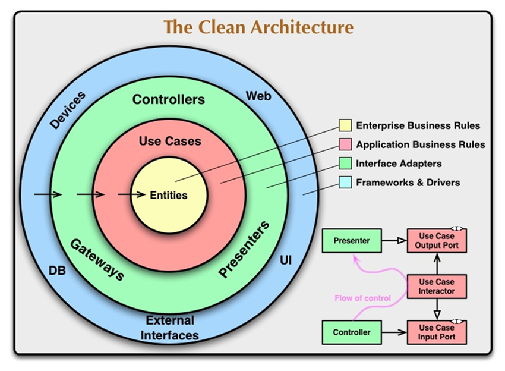
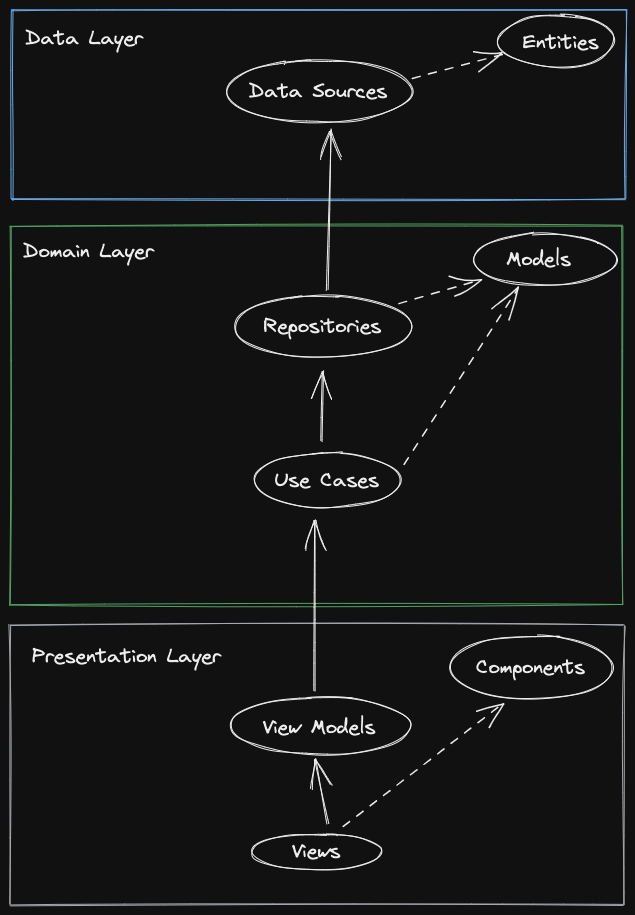
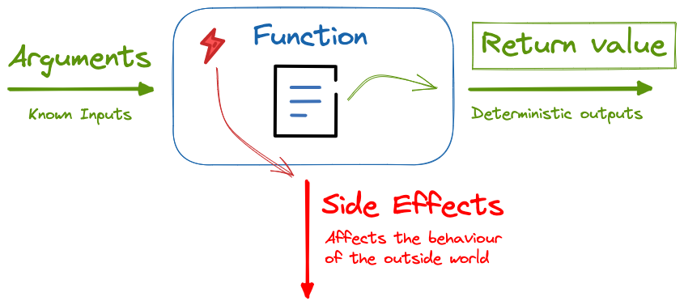
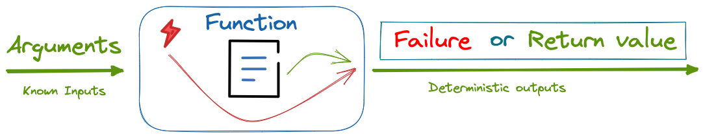

# Clean Architecture CRM (Customer relationship management)

In this project, we'll use the process of creating a CRM application to discuss a [Robert C Martin](https://en.wikipedia.org/wiki/Robert_C._Martin) philosophy called Clean Architecture.

We'll be using Flutter/Dart

### Use Cases of the Application
Customer Relationship Management (CRM) is a strategy that companies use to manage interactions (or tasks) with customers and potential customers (leads).

A use case, the essence of the application, is a written description of how users will perform tasks in your application. It outlines, from a user's point of view, a system's behavior as it responds to a request.

We'll implement the following use cases:
##### Customers
* Get all customers
* Create customer
* Update customer information
* Make customer inactive
* Make customer active
* Delete customer
 
##### Leads (Potential Customers )
* Get all leads
* Create new lead
* Convert lead to customer
* Update lead details

##### Tasks
* Get all activities for customer
* Create customer task
   

### What is Clean Architecture?
"Clean Architecture" was coined by [Robert C Martin](https://en.wikipedia.org/wiki/Robert_C._Martin) and is a software design philosophy that organizes code in such a way that business logic is kept separate from technical implementation (databases, APIs, frameworks). This makes application functionality easy to maintain, change and test.

Clean Architecture allow us to change the presentation (UI or consumer facing parts) or data source (databases, API or backend parts) easily without affecting business logic (use cases).


<div style="text-align:center">
  
  <p style="color:gray; font-size:13px">Uncle Bob's Clean Architecture</p>
</div>

A more contextual front-end application illustration of clean architecture would be the following image which illustrates flow of control and data.

<div style="text-align:center">
  
  <p style="color:gray; font-size:13px">Control and Data flow</p>
</div>

The pubspec.yaml file (located at the root of the project) specifies dependencies that the project requires, such as particular packages (and their versions). Let's install a few Flutter/Dart dependencies: 
* **Equatable** for object comparison
* **Dio** for HTTP calls
* **Mockito** for mocking dependencies in our tests
* **dartz** to help with functional programming in Dart
* **uuid** to genereate unique ids

```yaml
//pubspec.yaml
name: crm
description: Mobile CRM
publish_to: "none"
version: 1.0.0+1
environment:
  sdk: ">=2.18.2 <3.0.0"
dependencies:
  flutter:
    sdk: flutter
  cupertino_icons: ^1.0.2
  equatable: ^2.0.5
  dio: ^4.0.6
  uuid: ^3.0.6
  dartz: ^0.10.1
dev_dependencies:
  flutter_test:
    sdk: flutter
  flutter_lints: ^2.0.0
  mockito: ^5.3.2
  build_runner: ^2.3.0
flutter:
  uses-material-design: true
```

### Models
In any application, the first place to start would be the models of the application. Models typically represent real-world objects that are related to the problem or domain space. 

##### Customer Model
```dart
//lib/domain/models/customer.dart
import 'package:equatable/equatable.dart';

enum CustomerType {
  lead,
  customer,
}

class Customer extends Equatable {
  final String id;
  final String name;
  final String email;
  final CustomerType customerType;
  final bool isActive;

  const Customer({
    required this.id,
    required this.name,
    required this.email,
    this.isActive = true,
    this.customerType = CustomerType.customer,
  });

  @override
  List<Object> get props {
    return [id, name, email, isActive, customerType];
  }
}

```

##### Task Model

 ```dart
 //lib/domain/models/task.dart
 import 'package:crm/domain/models/customer.dart';

enum Status { notStarted, inProgress, completed }

enum Priority { low, normal, high }

class Task {
  final String id;
  final Customer customer;
  final Priority priority;
  final String subject;
  final Status status;
  final DateTime dueDate;

  const Task({
    required this.id,
    required this.customer,
    this.priority = Priority.high,
    this.status = Status.notStarted,
    required this.subject,
    required this.dueDate,
  });
}

 ```

### Error and Exception Handling
Typically exceptions and errors are caught and handled by using "try-catch" blocks wrapping a piece of code that might throw. Functions like these are said to have side effects.

<div style="text-align:center">
  
</div>

Languages like Java, allow you used to use the keyword "throws" to mark a function that might have exception side effects. The Dart language does not allow you to mark functions as potentially throwing, we typically allow the error to bubble up to a point where it can be centrally handled (typically near the UI). There is nothing wrong with this. We would like to however take a different approach. Instead of throwing exceptions, we'd like to catch side-effect exceptions and channel the failure to the function's return value.

<div style="text-align:center">
  
</div>

This is a Functional Programming (FP) approach of creating pure functions (functions without side effects). The [**dartz**](https://pub.dev/packages/dartz) package gives us the ability to write Dart in a more FP way. It has a type called **Either**  which is used to represent a value that can have two possible types. We'll use this type as our deterministic return type of the function

Let's define the Failure type
```dart
//lib/core/error/failures.dart
import 'package:equatable/equatable.dart';

abstract class Failure extends Equatable {
  const Failure([List props = const <dynamic>[]]);
}
```

We see this in action in our customer repository interface/contract.

```dart
//lib/domain/repository/interfaces/customer_repository.dart
import 'package:crm/core/error/failures.dart';
import 'package:crm/domain/model/customer.dart';

import "package:dartz/dartz.dart";

abstract class CustomerRepository {
  Future<Either<Failure, List<Customer>>> getAllCustomers(CustomerType customerType);
  Future<Either<Failure, Customer>> getCustomer(String id);
  Future<Either<Failure, Unit>> createCustomer(Customer data);
  Future<Either<Failure, Unit>> deleteCustomer(String id);
  Future<Either<Failure, Unit>> updateCustomer(
    String id, {
    String? name,
    String? email,
    CustomerType? customerType,
    bool? isActive,
  });
}


```
