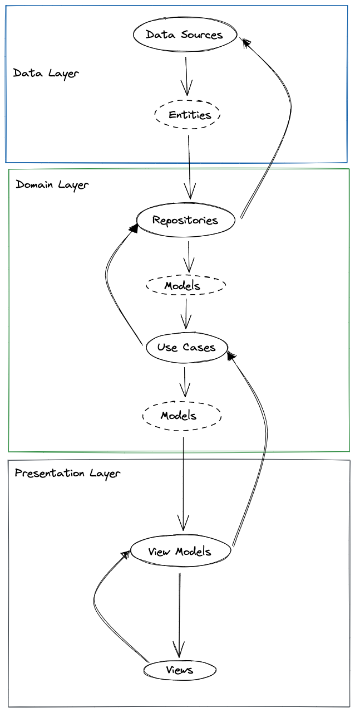

# Clean Architecture CRM (Customer relationship management)

In this project, we will explore the process of creating a CRM application using a [Robert C Martin](https://en.wikipedia.org/wiki/Robert_C._Martin) philosophy called Clean Architecture.

We'll be using Flutter/Dart for this application and discuss TDD and Error Handling

### Use Cases of the Application
Customer Relationship Management (CRM) is a strategy that companies use to manage interactions (or tasks) with customers and potential customers (leads).

We'll implement the following use cases:
##### Customers
* Get all customers
* Create customer
* Update customer information
* Make customer inactive
* Make customer active
* Delete customer
 
##### Leads (Potential Customers )
* Get all leads
* Create new lead
* Convert lead to customer
* Update lead details

##### Tasks
* Get all activities for customer
* Create customer task
   

### What is Clean Architecture?
"Clean Architecture" was coined by [Robert C Martin](https://en.wikipedia.org/wiki/Robert_C._Martin) and is a software design philosophy that organizes code in such a way that business logic is kept separate from technical implementation (databases, APIs, frameworks). This makes it easy to maintain, change and test.

We should be able to change the presentation (UI) or data source (databases or API) easily without changing the business logic (use cases).


<div style="text-align:center">
  
  <p style="color:gray; font-size:13px">Uncle Bob's Clean Architecture</p>
</div>


In the diagram, we see that each onion layer only knows and cares about its immediate inner layer as illustrated by arrows drawn from outer to inner.

A more contextual front-end application illustration of clean architecture would be the following image which illustrates flow of control and data.

<div style="text-align:center">
  
  <p style="color:gray; font-size:13px">Control and Data flow</p>
</div>

Before we start let's install a few flutter dependencies by adding the following packages to our *pubspec.yaml* file: 
* **Equatable** for object comparison
* **Dio** for HTTP calls
* **Mockito** for mocking dependencies in our tests
* **dartz** to help with functional programming in Dart
* **uuid** to genereate unique ids

```yaml
//pubspec.yaml
name: crm
description: Mobile CRM
publish_to: "none"
version: 1.0.0+1
environment:
  sdk: ">=2.18.2 <3.0.0"
dependencies:
  flutter:
    sdk: flutter
  cupertino_icons: ^1.0.2
  equatable: ^2.0.5
  dio: ^4.0.6
  uuid: ^3.0.6
  dartz: ^0.10.1
dev_dependencies:
  flutter_test:
    sdk: flutter
  flutter_lints: ^2.0.0
  mockito: ^5.3.2
  build_runner: ^2.3.0
flutter:
  uses-material-design: true
```

### Models
In any application, the first place to start would be the models of the application. Models typically represent real-world objects that are related to the problem or domain space. 

##### Customer Model
```dart
//lib/domain/models/customer.dart
import 'package:equatable/equatable.dart';

enum CustomerType {
  lead,
  customer,
}

class Customer extends Equatable {
  final String id;
  final String name;
  final String email;
  final CustomerType customerType;
  final bool isActive;

  const Customer({
    required this.id,
    required this.name,
    required this.email,
    required this.isActive,
    required this.customerType,
  });

  @override
  List<Object> get props {
    return [id, name, email, isActive, customerType];
  }
}
```

##### Task Model

 ```dart
 //lib/domain/models/task.dart
 import 'package:crm/domain/models/customer.dart';

enum Status { notStarted, inProgress, completed }

enum Priority { low, normal, high }

class Task {
  final String id;
  final Customer customer;
  final Priority priority;
  final String subject;
  final Status status;
  final DateTime dueDate;

  const Task({
    required this.id,
    required this.customer,
    this.priority = Priority.high,
    this.status = Status.notStarted,
    required this.subject,
    required this.dueDate,
  });
}

 ```

### Error and Exception Handling
Exception handling differs from error handling in that the former involves conditions an application might catch versus serious problems an application might want to avoid. In contrast, error handling helps maintain the normal flow of software program execution. 

Typically exceptions and errors are caught and handled by using "try-catch" blocks wrapping a piece of code that might throw. Functions like these are said to have side effects.

<div style="text-align:center">
  
</div>

Languages like Java, allow you used to use the keyword "throws" to mark a function that might have exception side effects. The Dart language does not allow you to mark functions as potentially throwing, we typically allow the error to bubble up to a point where it can be centrally handled (typically near the UI). There is nothing wrong with this. We would like to however take a different approach. Instead of the exception bubbling up, we'd like to catch side-effect exceptions as soon as possible allowing the function to return something through its return value.


#### Enter Functional Programming to help us
We'll use Functional programming to minimize or eliminate the side effects of these exceptions.
Instead of throwing an exception we now have a way of defining the return type of the function as Either returning an application type or Failure type.


<div style="text-align:center">
  
</div>

The **dartz** package has an *Either* type which holds 2 value types. One on the (L)eft and one on the (R)ight. We'll use this type as the deterministic return type for the function. 
Normally we put the Failure in the left one. Let's show this with code.

Let's define the Failure type
```dart
//lib/core/error/failures.dart
import 'package:equatable/equatable.dart';

abstract class Failure extends Equatable {
  const Failure([List props = const <dynamic>[]]);
}
```

Let's see this when we write an interface contract for our customer repository

```dart
//lib/domain/repository/interfaces/customer_repository.dart
import 'package:crm/core/error/failures.dart';
import 'package:crm/domain/model/customer.dart';

import "package:dartz/dartz.dart";

abstract class CustomerRepository {
  Future<Either<Failure, List<Customer>>> getAllCustomers();
  Future<Either<Failure, void>> createCustomer(Customer data);
  Future<Either<Failure, void>> deleteCustomer(String id);
  Future<Either<Failure, void>> updateCustomer(String id, Customer data);
}

```

And that's it. We'll now handle the side effect inside the function and return the appropriate Either result.  

#### TDD
We have just created non-testable pieces of production code (models and interfaces). It's not time to write some production code. We'll start with the business logic which exists with our use cases.

##### Use Case: Get All Customers
Before we create the "Get all customers" use cases let's define an interface for it. In Dart, we use abstract classes to define interfaces. Why do we need an interface? To dynamically inject this use case into code that is dependent on it we need an interface. 

```dart
//lib/domain/use_cases/customer/get_all_customers.dart
import 'package:crm/core/error/failures.dart';
import 'package:crm/domain/model/customer.dart';
import 'package:dartz/dartz.dart';

abstract class GetAllCustomers {
  Future<Either<Failure, List<Customer>>> execute();
}
```

We'll use the same file to hold the implementation of this interface, but we'll use TDD to drive the development of that implementation.


Let's write the first test
```dart
//test/domain/use_cases/customer/get_all_customers_test.dart
import 'package:crm/domain/repositories/implementations/customer_repository_impl.dart';
import 'package:crm/domain/use_cases/customer/get_all_customers.dart';
import 'package:mockito/mockito.dart';
import 'package:flutter_test/flutter_test.dart';

class MockCustomerRepository extends Mock implements CustomerRepository {}

void main() {
  GetAllCustomers usecase;
  MockCustomerRepository mockCustomerRepository;

  setUp(() {
    mockCustomerRepository = MockCustomerRepository();
    usecase = GetAllCustomersImpl(mockCustomerRepository);
  });

  test("should get all customers from the customer repository", () async {
    
  });
}
```

In this test, we create a mock customer repository and inject that into the use case. 

###### First Law
```
Write no production code until you have first written a test that fails due to the lack of that production code.
```

The test does not compile and thus fails. We need to create the production code to fix this.

```dart

```